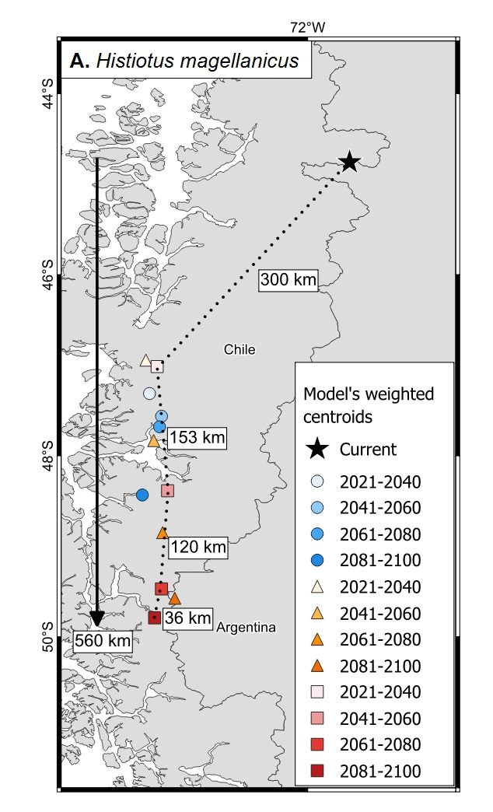

# 🌍 Climate Cul-de-Sacs  
**Modeling constrained range shifts under climate change**

## 🔎 Overview

Species are expected to track shifting climatic conditions under global change. However, when suitable climates move toward geographic boundaries—such as the southern tip of South America—range shifts may become **spatially constrained**, producing a *climate cul-de-sac*.

This repository contains reproducible workflows to:
- Model species’ climatic suitability
- Project future distributions under multiple climate scenarios
- Quantify **directional shifts in suitable habitat**
- Detect **range contraction and spatial trapping** at geographic limits

---

## 🧠 Key Idea

> Climate change does not always lead to range expansion or simple poleward shifts.  
> In some systems, species are funneled into geographic dead-ends.

We test this by tracking **suitability-weighted centroids** through time and evaluating whether distributions:
- shift directionally
- become spatially compressed
- accumulate near land boundaries

---

## 🗺️ Example: Climate cul-de-sac dynamics



**Interpretation:**
- Black star = historical centroid (baseline)
- Colored points = future centroids (by SSP and time period)
- Arrows = magnitude and direction of shift
- Distances (km) quantify displacement

### Patterns shown:
- **A. _Histiotus magellanicus_** → moderate shift with increasing spatial constraint  
- **B. _Lasiurus varius_** → limited displacement despite climate change  
- **C. _Myotis chiloensis_** → strong directional shift into a geographic endpoint  

👉 In panel C, suitable climate is effectively **trapped at the southern limit**, illustrating a clear *cul-de-sac*.

---

## ⚙️ Workflow

The pipeline follows a fully reproducible SDM framework:

1. **Data preparation**
   - Occurrence cleaning and filtering
   - Environmental predictor assembly

2. **Model fitting**
   - Presence–background models (e.g., XGBoost / GBM)
   - Bias-aware background selection

3. **Model evaluation**
   - AUC, PR AUC, F1, Kappa

4. **Projection**
   - Future climates (SSP245, SSP370, SSP585)
   - Time periods: 2021–2040, 2041–2060, 2061–2080, 2081–2100

5. **Post-processing**
   - Suitability maps
   - Weighted centroid estimation
   - Distance and direction of shifts

6. **Cul-de-sac metrics**
   - Directional displacement
   - Spatial concentration
   - Proximity to geographic limits

---

## 📁 Repository structure

```
scripts/        # ordered analysis workflow
R/              # reusable functions
data/           # raw + processed (not tracked)
outputs/        # maps, tables, figures
docs/           # metadata and notes
manuscript/     # text and figures for paper
```

---

## 🔬 Core Hypothesis

Species distributions are constrained by climate, but **geography limits their ability to track future conditions**. When suitable climate shifts toward land boundaries, species experience:
- restricted movement
- reduced suitable area
- increased extinction risk

---

## ⚠️ Assumptions

- Climatic suitability approximates distributional potential  
- Species–environment relationships are transferable through time  
- Dispersal, adaptation, and biotic interactions are not explicitly modeled  

---

## 📦 Reproducibility

This project uses **R + renv** for reproducible environments:

```r
renv::restore()
```

---

## 📜 License

MIT License — free to use, modify, and build upon.

---

## ✨ Why this matters

Conservation planning often assumes species can track climate change.  
This work shows that:

> **Geography can break that assumption.**

Climate cul-de-sacs identify regions where:
- conservation urgency is highest
- assisted migration may be needed
- climate adaptation strategies must account for spatial limits

---

## 📌 Citation (placeholder)

If you use this code or framework, please cite:

> *Author(s). Climate cul-de-sacs: constrained range shifts under climate change. (in prep)*

---

## 🚀 Next steps

- Integrate dispersal constraints  
- Add hazard overlays (heatwaves, fire)  
- Expand to multi-species or community-level dynamics  
